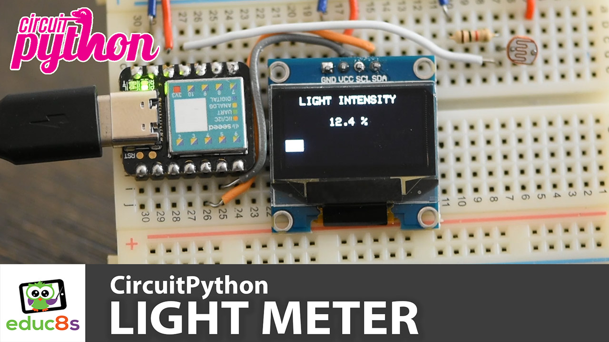
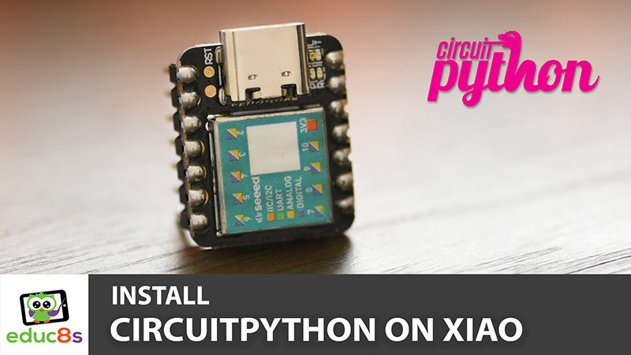
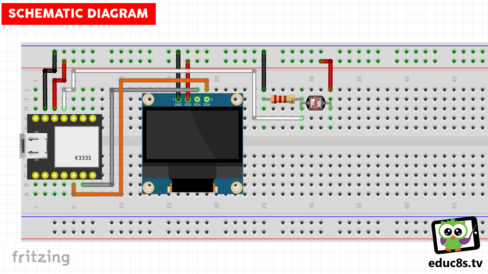

# CircuitPython Light-Meter
This is a simple Light Meter using Seeeduino Xiao board, a photoresistor and an OLED SSD1306 display.

  

# Parts used

🛒 Arduino Xiao: http://educ8s.tv/part/xiao

🛒 SSD1306 OLED: http://educ8s.tv/part/OLED096

🛒 Photoresistor: http://educ8s.tv/part/Photoresistors

🛒 100K resistor: http://educ8s.tv/part/Resistors

🛒 Breadboard: http://educ8s.tv/part/SmallBreadboard

🛒 Wires: http://educ8s.tv/part/JumperWires

💖 Full disclosure: All of the links above are affiliate links. I get a small percentage of each sale they generate. Thank you for your support!

# How to install CircuitPython on the Seeeduino Xiao

The Seeeduino Xiao board comes with the Arduino bootloader pre-loaded when you buy it. If you want to program it using CircuitPython you have to load the CircuitPython bootloader to it. Watch the following video to find out how to do it.

  

🎥 [Watch the video on YouTube](https://www.youtube.com/watch?v=1GKF9u7pVgs)

# Schematic Diagram

  

# Credits & Thanks

  - Kudos to [Adafruit Industries](https://github.com/adafruit) for being the creator of the display libraries without which this project would not exist.

